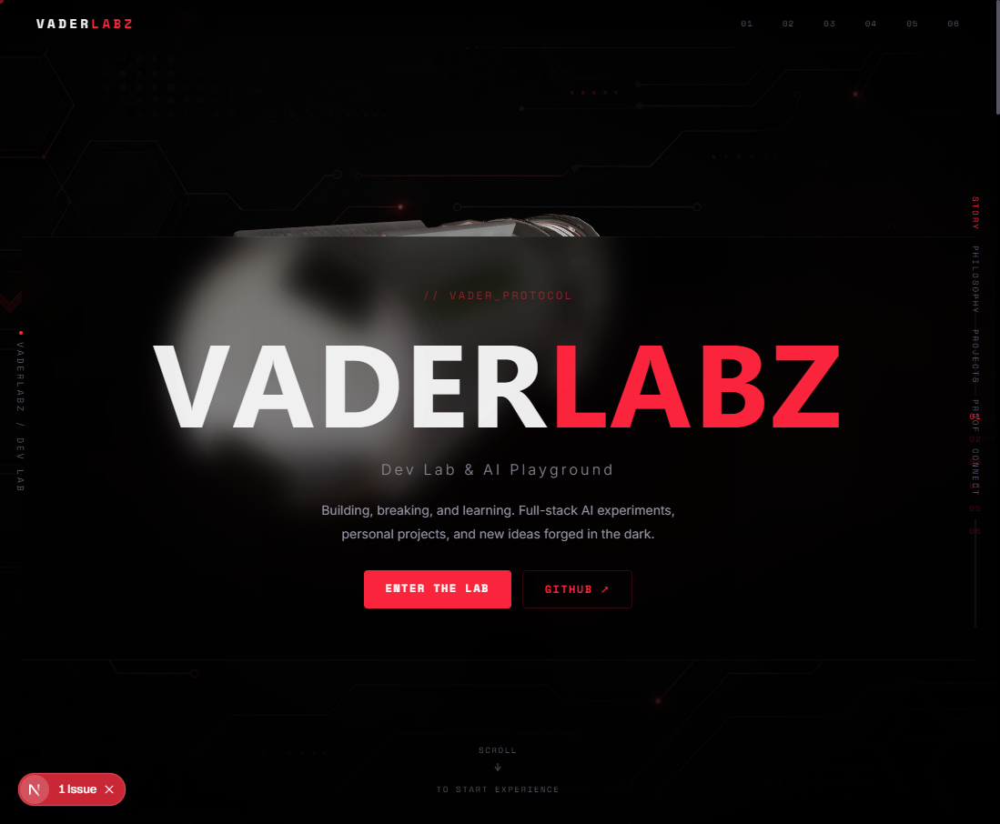

# VaderLabz — Dev Lab & AI Playground

**Building, breaking, and learning. Full-stack AI experiments, personal projects, and new ideas forged in the dark.**

[]()
[]()
[](https://nextjs.org)
[](https://docs.pmnd.rs/react-three-fiber)
[](LICENSE)

---

> **Live site:** [vaderlabz.com](https://vaderlabz.com/) — placeholder page until first deploy

## Screenshots




## Overview

VaderLabz is a personal dev playground and portfolio site showcasing full-stack AI experiments, open-source projects, and tools built across the VaderLabz ecosystem. It features a dark, cinematic 3D UI powered by Three.js with the **Vader Red** (#ff2a36) design palette.

### Pages

| Page | Description |
|------|-------------|
| **/** | Main portfolio homepage — story, philosophy, projects, proof, stats |
| **/vader-experience** | Immersive scroll-driven 3D narrative with lightsaber model, 5 chapters, glassmorphism panels |

### Projects featured

| Project | Status | Description |
|---------|--------|-------------|
| [Boilerplate-v2](https://github.com/jonbeatz/Boilerplate-v2) | Active | Cursor-native full-stack boilerplate with 52-point self-grader, isolated sandboxes, Biome, MCP |
| [Node-Launcher](https://github.com/jonbeatz/Node-Launcher) | Active | Vader Project Engine — Electron launcher with SQLite, sandboxing, forge automation |
| [MSC-Projectz](https://github.com/jonbeatz/MSC-Projectz) | Building | Project management dashboard for the VaderLabz ecosystem |
| [Hermes Core Scripts](https://github.com/jonbeatz/_core-scripts) | Active | Shared-profile-content skeleton — reusable brain for bootstrapping new projects |

## Tech Stack

| Layer | Technology |
|-------|-----------|
| **Framework** | Next.js 16 (App Router) |
| **Language** | TypeScript |
| **3D Engine** | Three.js / React-Three-Fiber / Drei |
| **Animation** | GSAP / ScrollTrigger, Motion |
| **Styling** | CSS Modules + Tailwind CSS v3 |
| **Design** | Vader Red palette (#ff2a36) |
| **AI Backend** | LiteLLM proxy (DeepSeek V4) + LM Studio (local) |
| **Memory** | Mem0 vector store (Qdrant) |
| **Deploy** | Static export → Hostinger hPanel |

## Project Structure

| Path | Contents |
|------|----------|
| `app/` | Next.js App Router pages and layouts |
| `components/` | Shared components (ThreeBackground, ArtefactScene, etc.) |
| `public/media/` | 3D models, HDR maps, images, logos |
| `scripts/` | Backup and utility scripts |
| `.cursor/` | Agent brain: rules, prompts, skills, docs, MCP config |
| `.cursor/3D/` | 3D model source files |
| `TRUTH.md` | Project constitution and core rules |

## Getting Started

```bash
npm install
npm run web:dev      # Development server on http://localhost:3000
npm run web:build    # Production build
npm run web:start    # Start production server
```

### Available Commands

| Command | Description |
|---------|-------------|
| `npm run web:dev` | Start Next.js dev server |
| `npm run web:build` | Production build |
| `npm run web:start` | Start production server |
| `npm run backup:quick` | Quick backup |
| `npm run backup:full` | Full project backup |
| `npm run mem0:search` | Search Mem0 memory |
| `npm run mem0:add` | Add to Mem0 memory |
| `npm run session:start` | Start project session |
| `npm run session:stop` | Stop project session |

## License

MIT
