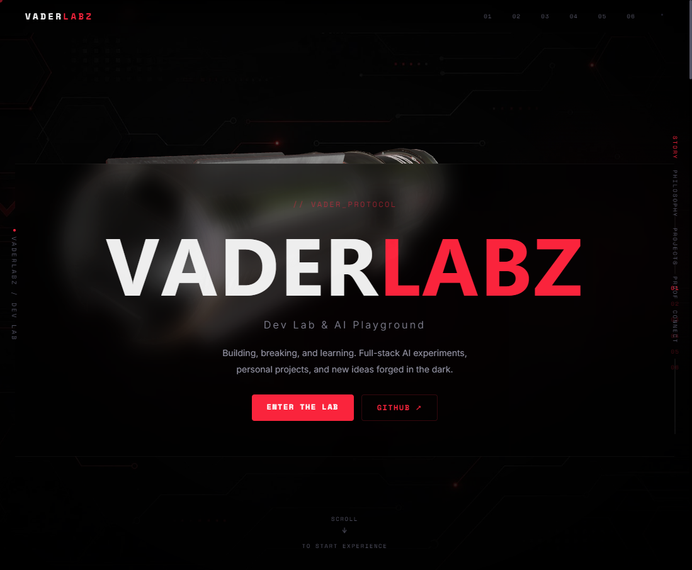
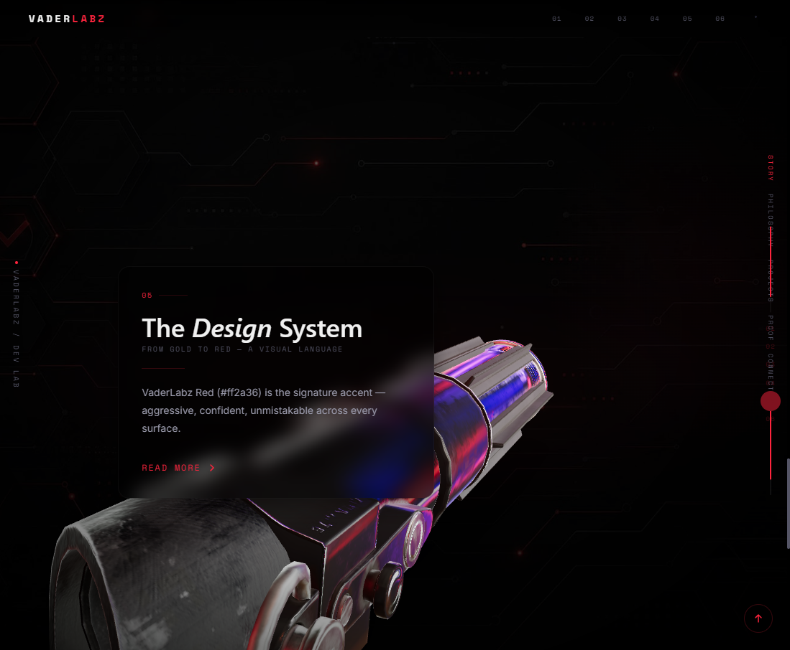

# VaderLabz — Dev Lab & AI Playground

**Building, breaking, and learning. Full-stack AI experiments, personal projects, and new ideas forged in the dark.**

[](https://github.com/jonbeatz/VaderLabz)
[](https://github.com/jonbeatz/VaderLabz/releases)
[](https://github.com/jonbeatz/VaderLabz/releases)
[](https://github.com/jonbeatz/VaderLabz)
[](LICENSE)
[](https://nextjs.org)
[](https://docs.pmnd.rs/react-three-fiber)
[](https://cursor.sh)



---

> **Single source of truth:** Read **[`TRUTH.md`](TRUTH.md)** first, then **[`.cursor/docs/START-HERE.md`](.cursor/docs/START-HERE.md)**.

## 📊 Current Status

| Metric | Value |
| :--- | :--- |
| **Version** | `v2.0.0` · [Latest release](https://github.com/jonbeatz/VaderLabz/releases/tag/v2.0.0) |
| **Stack** | Next.js 16 (App Router) + Three.js / React-Three-Fiber / Drei |
| **3D Engine** | 🗡️ Darth Vader Lightsaber model — scroll-driven camera orbit + glassmorphism panels |
| **Live Site** | 🌐 [vaderlabz.com](https://vaderlabz.com) — placeholder page until first deploy |
| **Memory** | 🧠 Mem0 + Qdrant (VaderLabz collection) — cross-session AI agent memory |
| **AI Backend** | 🤖 LiteLLM (DeepSeek V4 proxy) + LM Studio (local) |
| **Verified** | 🟢 `npm run web:build` (Clean build + Static generation) |
| **Status** | ⚡ ACTIVE DEVELOPMENT — v2 branch |

---

## Screenshots

### Immersive 3D Narrative Homepage


*The full-page immersive 3D narrative — lightsaber model, glassmorphism panels, and scroll-driven camera orbit.*

### Design System & Chapters


*Chapter sections with glassmorphism panels, Vader Red accent, and soft glow effects.*

---

## 1. Project Overview

VaderLabz is a **personal dev playground and portfolio site** showcasing full-stack AI experiments, open-source projects, and tools built across the VaderLabz ecosystem. It powers:

- A dark cinematic 3D UI with Vader Red (#ff2a36) design palette
- Immersive scroll-driven narrative with 5 chapters (Genesis, Skeleton System, Draven, Command Center, Design System)
- A custom lightsaber 3D model with scroll-driven camera orbit and mouse parallax
- Glassmorphism content panels with soft red glow effects
- Clickable smooth-scroll navigation (top nav + right side progress bar)
- Draven persistent AI co-pilot integration with cross-session Mem0 memory
- Safe experimental sandbox at `/vader-experience-v2` for testing alternate versions

**Profile root:** `D:\Hermes\projects\VaderLabz`

---

## 2. Tech Stack

| Layer | Technology | Purpose |
|-------|-----------|---------|
| **Framework** | Next.js 16 (App Router, React 19) | Frontend + routing |
| **3D Engine** | Three.js / React-Three-Fiber / Drei | Lightsaber model, camera orbit, environment |
| **Animation** | GSAP + ScrollTrigger | Scroll-driven transitions and reveal effects |
| **Styling** | CSS Modules + Tailwind CSS v3 | Component-level + utility-first styles |
| **Design** | Vader Red (#ff2a36) — dark cinematic palette | Signature accent color system |
| **AI Agent** | Draven (Hermes-based co-pilot) | Persistent cross-session AI assistant |
| **Memory** | Mem0 + Qdrant (local) | Persistent semantic memory across sessions |
| **Deploy** | Static export → Hostinger hPanel | Production hosting |

---

## 3. Pages & Routes

| Route | Description |
|-------|-------------|
| **`/`** | **Main site** — immersive 3D narrative with lightsaber, glass panels, 5 chapters |
| **`/vader-experience`** | Redirects to `/` (legacy route preserved for old links) |
| **`/vader-experience-v2`** | Safe fallback — exact copy for experimentation and alternate versions |
| **`/archive`** | Original homepage preserved for reference |

---

## 4. Quick Start

```bash
git clone https://github.com/jonbeatz/VaderLabz.git
cd VaderLabz
npm install
npm run web:dev      # Development server on http://localhost:3000
```

**Open `http://localhost:3000`** — The VaderLabz immersive experience.

Verify the baseline gate:

```bash
npm run web:build    # Clean build + integrity check
```

> **Requirements:** Node 18+ · npm ≥ 10  
> **Secrets:** Live keys belong in `.env.local` only — never commit secrets.  
> **Agent ritual:** Say `Begin project` in Cursor chat for full cold-start — see START-HERE.md.

---

## 5. Architecture

```
VaderLabz
├── app/                    # Next.js App Router pages
│   ├── page.tsx            # Main immersive 3D narrative page (/)
│   ├── archive/            # Original homepage (archived)
│   ├── vader-experience/   # Legacy route → redirects to /
│   └── vader-experience-v2/ # Safe fallback copy for experiments
├── components/             # Shared React components
│   ├── ThreeBackground     # 3D particle/starfield background
│   ├── ArtefactScene       # 3D artefact display
│   ├── CustomCursor        # Custom cursor component
│   └── StudioRails         # Vignette + grain overlays
├── lib/                    # Utility libraries & hooks
├── public/media/           # 3D models, HDR maps, images, screenshots
├── scripts/                # Backup & utility scripts
├── .cursor/                # Agent brain: rules, prompts, skills, docs
└── TRUTH.md                # Project constitution & core rules
```

---

## 6. Available Commands

| Command | Description |
|---------|-------------|
| `npm run web:dev` | Start Next.js dev server |
| `npm run web:build` | Production build |
| `npm run web:start` | Start production server |
| `npm run backup:quick` | Quick project backup |
| `npm run backup:full` | Full project mirror backup |
| `npm run mem0:search` | Search Mem0 vector memory |
| `npm run mem0:add` | Add to Mem0 memory |
| `npm run session:start` | Start project session ritual |
| `npm run session:stop` | Stop project session ritual |

---

## 7. Documentation

| Document | Purpose |
|----------|---------|
| [TRUTH.md](TRUTH.md) | Project constitution & core rules |
| [CHANGELOG.md](CHANGELOG.md) | Release history |
| [ENV-VARS-REFERENCE.md](ENV-VARS-REFERENCE.md) | Environment variable registry |
| [SKILL-INDEX.md](SKILL-INDEX.md) | Available domain skills |
| [TROUBLESHOOTING.md](TROUBLESHOOTING.md) | Known issues & fixes |
| [AGENTS.md](AGENTS.md) | Agent instructions |
| `.cursor/docs/START-HERE.md` | Daily ops & doc order |
| `.cursor/docs/MASTER-COMMANDS.md` | Command reference |
| `.cursor/docs/ReCall.md` | Session memory log |
| `.cursor/docs/project-log.md` | Session history |

---

## 8. Design System

- **Primary Accent:** `#ff2a36` (Vader Red)
- **Background:** `#000000` (Deep Black)
- **Text:** `#f0f0f0` / `#888899` / `#555566` (3-tier hierarchy)
- **Glass:** `rgba(0,0,0,0.55)` with `backdrop-filter: blur(12px)`
- **Typography:** Inter (sans-serif) + JetBrains Mono (code/monospace)
- **3D Scene:** Lightsaber model with scroll-driven camera orbit & mouse parallax

---

## 9. License

MIT © VaderLabz

---

*Powered by the VaderLabz Dev Engine · v2.0.0*
